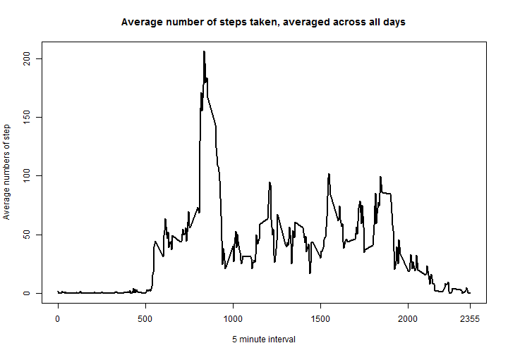

# Reproducible Research: Peer Assessment 1


## Loading and preprocessing the data

```r
activity <- read.table("activity.csv", header = TRUE, sep = ",", stringsAsFactors = FALSE, colClasses = c("integer", "Date", "integer"))
```

## What is mean total number of steps taken per day?

```r
library(plyr)
steps <- ddply(activity, "date", function(x) {data.frame(date = x$date[1], total.steps = sum(x$steps, na.rm = TRUE))})
```


```r
library(ggplot2)
library(scales)

ggplot(data = steps, aes(x=steps$date, y=steps$total.steps)) + geom_bar(stat="identity")  + scale_x_date(breaks="1 week", labels=date_format("%Y-%m-%d"), limits=c(as.Date("2012-10-01"),as.Date("2012-11-30") + 1)) + ylab("Number of steps") + xlab("Date") + theme_bw() + ggtitle("Total number of steps taken each day")
```

 


```r
steps.mean <- mean(steps$total.steps, na.rm = TRUE)
steps.median <- median(steps$total.steps, na.rm = TRUE)
```
mean total number of steps taken per day is 9354.2295  
median total number of steps taken per day is 10395  

## What is the average daily activity pattern?

```r
steps.avg <- ddply(activity, "interval", function(x) {data.frame(interval = x$interval[1], avg.steps = mean(x$steps, na.rm = TRUE))})

plot(steps.avg$interval, steps.avg$avg.steps, type = 'l', lwd = 2, xlab = "5 minute interval", ylab = "Average numbers of step")
axis(side = 1, at = max(steps.avg$interval))
title("Average number of steps taken, averaged across all days")
```

 

```r
max.interval <- steps.avg$interval[which.max(steps.avg$avg.steps)]
```

The 835th interval contains the maximum number of steps on average across all the days in the dataset

## Imputing missing values

```r
num.NA <- length(which(is.na(activity$steps)))
# Using the mean for that 5-minute interval to fill missing values
fill.NA <- function(x) 
{
    indx.na <- which(is.na(x$steps))
    x$steps[indx.na] <- steps.avg[steps.avg$interval == x$interval[1], ]$avg.steps
    return(x)
}

activity.filled <- ddply(activity, "interval", fill.NA)
activity.filled <- activity.filled[order(activity.filled$date), ]

steps.filled <- ddply(activity.filled, "date", function(x) {data.frame(date = x$date[1], total.steps = sum(x$steps, na.rm = TRUE))})

ggplot(data = steps.filled, aes(x=steps.filled$date, y=steps.filled$total.steps)) + geom_bar(stat="identity")  + scale_x_date(breaks="1 week", labels=date_format("%Y-%m-%d"), limits=c(as.Date("2012-10-01"),as.Date("2012-11-30") + 1)) + ylab("Number of steps") + xlab("Date") + theme_bw() + ggtitle("Total number of steps taken each day after imputing missing data")
```

 

```r
steps.mean.filled <- mean(steps.filled$total.steps, na.rm = TRUE)
steps.median.filled <- median(steps.filled$total.steps, na.rm = TRUE)
```

After imputing missing data with the mean for that 5-minute interval, the mean of total number of steps taken per day is 1.0766 &times; 10<sup>4</sup> and the median is 1.0766 &times; 10<sup>4</sup>. So both numbers have been increased compared to the no filled data. Imputing missing data increases the estimates of the total daily number of steps.

## Are there differences in activity patterns between weekdays and weekends?

```r
weekday.ch <- c("Monday", "Tuesday", "Wednesday", "Thursday", "Friday")
weekend.ch <- c("Saturday", "Sunday")

activity.filled$weekdays <- ifelse(is.element(weekdays(activity.filled$date), weekday.ch), "weekday", "weekend")

steps.avg.flled <- ddply(activity.filled, .(weekdays, interval), function(x) {data.frame(interval = x$interval[1], avg.steps = mean(x$steps, na.rm = TRUE), weekdays = x$weekdays[1])})

g <- ggplot(steps.avg.flled, aes(interval, avg.steps))
g + geom_line(size = 1) + facet_grid(weekdays ~ .) + labs(x = "Interval") + labs(y = "Number of steps") 
```

 

During weekday, there are more activities in the first half of the day, while during weekend, activities are more even spread out. 

